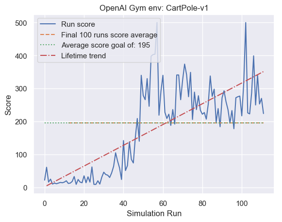

# Deep Q Neural Network to solve OpenAI Cart Pole challenge

# Top 5 in leaderboard!

Keras Machine Learning

    Observation: 
        Type: Box(4,)
        Num	Observation                 Min         Max
        0	Cart Position             -4.8            4.8
        1	Cart Velocity             -Inf            Inf
        2	Pole Angle                 -24°           24°
        3	Pole Velocity At Tip      -Inf            Inf
        
    Action:
        Type: Discrete(2)
        Num	Action
        0	Push cart to the left
        1	Push cart to the right
        

Photo of scores through life of model till solved

GIF of first five iterations to show starting point

GIF of final iteration to show end point

